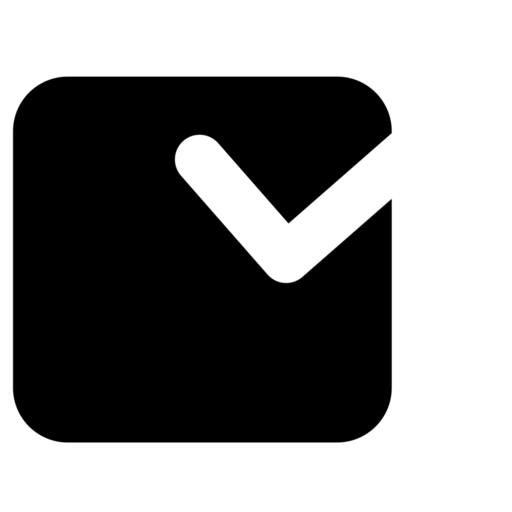

  <h1>Dooist</h1>
  
Easy Peasy Todo List

 

## Project Overview
This project is a simple todo list app. You can add, edit, delete, and mark as done your todo list.

I create this project to following technical test from [DuaDigital](https://duadigital.com/).

## Project Features
- Add todo list
- Update todo list
- Responsive UI
- Basic Animation
- Client Side Storage
- PWA Support

## Project Tech Stack
- Next.js
- Tailwind CSS
- Zustand
- etc. (see [package.json](package.json))

